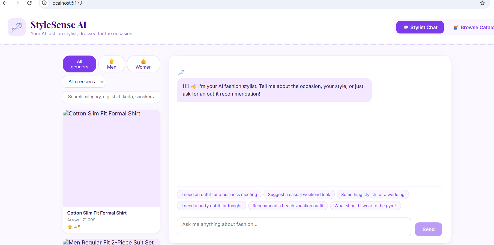

# 👗 Fashion AI Assistant 🤖

An AI-powered fashion recommendation platform that helps users discover personalized outfits based on gender, occasion, style preferences, and budget.

The project combines a curated fashion dataset, Google's Gemini AI, FastAPI, and React to deliver intelligent outfit recommendations and conversational fashion guidance.

---

## 🚀 Live Demo

### Frontend

https://fashion-ai-frontend-osvx.onrender.com

### Backend API

https://fashion-ai-backend-jskx.onrender.com

### API Documentation

https://fashion-ai-backend-jskx.onrender.com/docs

---

# ✨ Features

* AI-powered fashion assistant using Google Gemini AI
* Personalized outfit recommendations
* Occasion-based outfit matching
* Gender-specific recommendations
* Budget-aware fashion suggestions
* Conversational fashion chatbot
* Product catalog browsing
* Outfit explanation generation using AI
* Product image support
* FastAPI REST API backend
* Modern React frontend
* Cloud deployment using Render

---

# 🛠️ Tech Stack

## Frontend

* React.js
* Vite
* JavaScript
* Axios
* CSS

## Backend

* FastAPI
* Python
* Pandas
* Uvicorn
* Pydantic

## AI Integration

* Google Gemini API
* google-genai SDK

## Deployment

* Render (Frontend)
* Render (Backend)
* GitHub

---

# 📂 Project Structure

```text
fashion-ai-recommendation/

├── backend/
│   ├── app/
│   │   ├── data/
│   │   │   ├── images/
│   │   │   ├── outfits.csv
│   │   │   └── products.csv
│   │   │
│   │   ├── routes/
│   │   ├── schemas/
│   │   ├── services/
│   │   ├── config.py
│   │   └── main.py
│   │
│   ├── requirements.txt
│   └── render.yaml
│
├── frontend/
│   ├── public/
│   ├── src/
│   │   ├── components/
│   │   ├── services/
│   │   ├── pages/
│   │   └── App.jsx
│   │
│   ├── package.json
│   └── vite.config.js
│
├── screenshots/
├── README.md
└── .gitignore
```

---

# 🔌 API Endpoints

## Health Check

```http
GET /api/health
```

Returns backend status and dataset information.

---

## Outfit Recommendation

```http
POST /api/recommend
```

Generates personalized outfit recommendations.

Example Request:

```json
{
  "message": "I need a casual outfit for college",
  "gender": "men",
  "occasion": "casual",
  "style_preference": "minimalist",
  "budget_inr": 3000
}
```

---

## Fashion Chat Assistant

```http
POST /api/chat
```

Provides conversational fashion guidance.

---

## Product Catalog

```http
GET /api/products
```

Returns fashion products from the dataset.

---

## Outfit Details

```http
GET /api/outfits/{outfit_id}
```

Returns details for a specific outfit.

---

# 📊 Dataset Statistics

| Metric             | Count    |
| ------------------ | -------- |
| Products Loaded    | 68       |
| Curated Outfits    | 25       |
| Fashion Categories | Multiple |
| Fashion Brands     | Multiple |

---

# ⚙️ Local Installation

## Backend Setup

```bash
cd backend

pip install -r requirements.txt

uvicorn app.main:app --reload
```

Backend runs at:

```text
http://127.0.0.1:8000
```

---

## Frontend Setup

```bash
cd frontend

npm install

npm run dev
```

Frontend runs at:

```text
http://localhost:5173
```

---

# 🔑 Environment Variables

Create a `.env` file inside the backend directory.

```env
GEMINI_API_KEY=your_gemini_api_key
GEMINI_MODEL=gemini-2.5-flash
```

---

# 📸 Screenshots

## 🏠 Home Page

Add your homepage screenshot here.

```markdown

```

---

## 🤖 Outfit Recommendation

Add your recommendation screenshot here.

```markdown

```

---

## 🛍️ Product Catalog

Add your product catalog screenshot here.

```markdown

```

---

## 💬 Fashion Chat Assistant

Add your chatbot screenshot here.

```markdown

```

---

# 🎯 Key Learning Outcomes

* Full Stack Application Development
* REST API Design with FastAPI
* React Frontend Development
* AI Integration using Gemini API
* Data Processing with Pandas
* Environment Variable Management
* Git and GitHub Workflows
* Cloud Deployment with Render
* Frontend–Backend Integration

---

# 🔮 Future Enhancements

* User Authentication
* Wishlist and Favorites
* Fashion Trend Analysis
* Image-Based Outfit Search
* Recommendation Personalization
* User Profiles
* Shopping Cart Integration
* Multi-Language Support

---

# 👨‍💻 Author

**Sathwik Samudrala**

GitHub:
https://github.com/Sathwik-Samudrala

---

# ⭐ Acknowledgements

* Google Gemini AI
* FastAPI
* React
* Render
* Pandas
* Open Source Community
